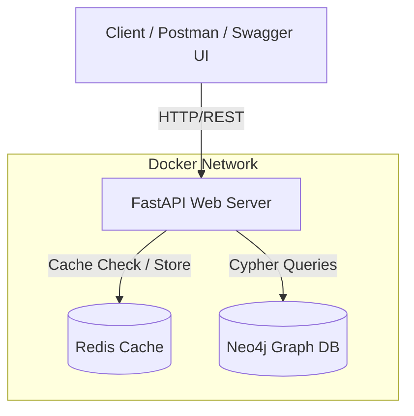

# System Architecture & Design Document

## 1. High Level Architecture (HLD)

The system is a containerised microservice for social graph operations.



**Components:**
1. **FastAPI** — Handles HTTP requests, input validation via Pydantic, and business logic routing.
2. **Neo4j** — The primary source of truth. Stores `User` nodes and `CONNECTED` relationships. Uses native `shortestPath()` for graph traversal.
3. **Redis** — Caches shortest path results with a 1-hour TTL to ensure sub-10ms response times on repeated queries.

---

## 2. Low Level Architecture (LLD)

A strict **4-Tier Architecture** inside the FastAPI application:

```
Router / API Layer   →   Service Layer   →   Repository Layer   →   Database Layer
  (app/api/)              (app/services/)     (app/repositories/)     (app/db/)
```

| Layer | Folder | Responsibility |
|---|---|---|
| **API / Router** | `app/api/` | Receive request, validate payload, call service |
| **Service / Logic** | `app/services/` | Orchestrate cache + DB, format response |
| **Repository / DB** | `app/repositories/` | Execute raw Cypher/Redis queries |
| **Connection Drivers** | `app/db/` | Manage Neo4j driver + Redis client singletons |

---

## 3. Request Workflow: Pathfinding

```
GET /api/v1/path/{start}/{end}
         │
         ▼
  routes_graph.py (Router)
         │
         ▼
  pathfinder.py (Service)
         │
         ├── redis_cache.get_cached_path()
         │         │
         │    ┌────┴────┐
         │    │ HIT     │ MISS
         │    ▼         ▼
         │  Return    graph_repo.find_shortest_path()
         │  cached        │
         │  result    Neo4j shortestPath() query
         │                │
         │            redis_cache.set_cached_path()
         │                │
         └────────────────┘
                  │
                  ▼
           PathResponse JSON
```

**Result:**
- **Cache Hit** → ~5ms response time
- **Cache Miss** → ~50–200ms (Neo4j query) → result cached for 1 hour

---

## 4. Friend Suggestion Workflow

```
GET /api/v1/suggestions/{user_id}
         │
         ▼
   graph_repo.get_friend_suggestions()
         │
         ▼
  Cypher: Find friends-of-friends (2-hop)
  not already connected to user,
  ranked by mutual friend count DESC
         │
         ▼
   SuggestionResponse JSON (top 10)
```

---

## 5. Final Folder Structure

```text
social-network-pathfinding/
│
├── app/
│   ├── main.py                     # FastAPI app, lifespan, CORS, router registration
│   │
│   ├── api/
│   │   ├── __init__.py
│   │   ├── routes_users.py         # POST /users, GET /users/{id}, GET /users/search
│   │   └── routes_graph.py         # POST /connections, GET /path, GET /suggestions
│   │
│   ├── core/
│   │   ├── __init__.py
│   │   ├── config.py               # Environment variables via pydantic-settings
│   │   ├── exceptions.py           # Custom HTTP exceptions (404, 409)
│   │   └── logging_config.py       # Structured JSON logging setup
│   │
│   ├── db/
│   │   ├── __init__.py
│   │   ├── neo4j_db.py             # Singleton Neo4j driver + FastAPI dependency
│   │   └── redis_cache.py          # Redis get/set helpers with TTL
│   │
│   ├── models/
│   │   ├── __init__.py
│   │   └── schemas.py              # Pydantic request/response models
│   │
│   ├── repositories/
│   │   ├── __init__.py
│   │   ├── user_repo.py            # Neo4j: create user, get by id, search
│   │   └── graph_repo.py           # Neo4j: create connection, shortestPath, suggestions
│   │
│   └── services/
│       ├── __init__.py
│       ├── user_service.py         # User business logic
│       └── pathfinder.py           # Cache → Neo4j → Cache-Store orchestration
│
├── scripts/
│   └── seed_data.py                # Downloads Stanford SNAP Facebook dataset & ingests into Neo4j
│
├── documentation/
│   └── architecture.md             # This document
│
├── docker-compose.yml              # FastAPI + Neo4j + Redis containers
├── Dockerfile                      # Multi-stage FastAPI image
├── requirements.txt                # Python dependencies
├── .env                            # Environment variables (not committed to git)
└── README.md                       # Project documentation
```

---

## 6. Data Strategy

**Dataset:** Stanford SNAP — Facebook Social Circles (`ego-Facebook`)
- **Nodes:** 4,039 users
- **Edges:** 88,234 connections
- **Source:** https://snap.stanford.edu/data/ego-Facebook.html

The `seed_data.py` script downloads this dataset (~1 MB compressed) and batch-imports it into Neo4j in transactions of 500 records, demonstrating awareness of database write performance.

---

## 7. API Endpoints

| Method | Endpoint | Description |
|---|---|---|
| `GET` | `/health` | API health check |
| `POST` | `/api/v1/users` | Create a new user |
| `GET` | `/api/v1/users/{id}` | Get user by ID |
| `GET` | `/api/v1/users/search?q=` | Search users by name |
| `POST` | `/api/v1/connections` | Create a connection between two users |
| `GET` | `/api/v1/path/{start}/{end}` | Find shortest path between two users |
| `GET` | `/api/v1/suggestions/{user_id}` | Get friend suggestions (friends-of-friends) |
