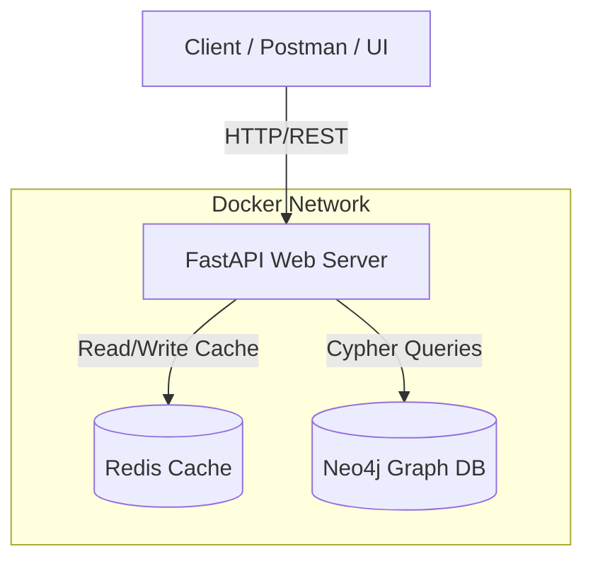

# System Architecture & Design Document

## 1. High Level Architecture (HLD)

The system is designed as a modular, containerized microservice that handles social graph operations.



**Components:**
1.  **FastAPI (Application Layer):** Handles HTTP requests, input validation, and business logic.
2.  **Neo4j (Data Layer):** The primary source of truth. Stores Users as `Nodes` and Friendships as `Edges` (Relationships). Optimized for deep graph traversal.
3.  **Redis (Cache Layer):** Stores frequently requested paths to ensure sub-100ms response times and reduce load on Neo4j.

---

## 2. Low Level Architecture (LLD)

Inside the FastAPI Application, we follow a strict **3-Tier Architecture**:

1.  **Router/API Tier (`app/api/`):** 
    *   Receives the request.
    *   Validates the payload using Pydantic schemas.
    *   Passes data to the Service layer.
2.  **Service/Business Logic Tier (`app/services/`):** 
    *   Contains the core algorithms.
    *   Checks the Redis cache first.
    *   If cache miss, queries the database.
    *   Formats the response and updates the cache.
3.  **Database/Repository Tier (`app/db/`):** 
    *   Manages connection pools.
    *   Executes raw Cypher queries against Neo4j.
    *   Executes set/get commands against Redis.

---

## 3. System Workflow (Pathfinding Example)

When a user requests the shortest path between `User A` and `User B`:

1.  **Request:** `GET /api/v1/path/A/B` hits the FastAPI router.
2.  **Validation:** FastAPI ensures `A` and `B` are valid UUIDs/Strings.
3.  **Cache Check:** Service layer asks Redis: `GET path:A:B`.
    *   *If Cache Hit:* Return path immediately (Response time: ~5ms).
    *   *If Cache Miss:* Proceed to step 4.
4.  **Database Query:** Service layer sends a Cypher query to Neo4j to find the shortest path using Neo4j's native bidirectional BFS.
5.  **Cache Update:** Store the result in Redis with a TTL (e.g., 1 hour): `SETEX path:A:B 3600 <result>`.
6.  **Response:** Return the path to the user (Response time: ~50ms).

---

## 4. Final Folder Structure & File Contents

This is the exact structure we are building. Every file has a specific, single responsibility.

```text
social-network-pathfinding/
├── app/
│   ├── __init__.py
│   ├── main.py                  # FastAPI application instance, CORS setup, router inclusion
│   ├── api/
│   │   ├── __init__.py
│   │   ├── routes_users.py      # Endpoints: POST /users, GET /users/{id}
│   │   ├── routes_graph.py      # Endpoints: POST /connections, GET /path, GET /suggestions
│   ├── core/
│   │   ├── __init__.py
│   │   ├── config.py            # Environment variables (DB_URL, Redis_URL) using pydantic-settings
│   │   ├── exceptions.py        # Custom error handlers (e.g., UserNotFoundException)
│   ├── db/
│   │   ├── __init__.py
│   │   ├── neo4j_db.py          # Neo4j connection pooling and raw Cypher execution
│   │   ├── redis_cache.py       # Redis connection and caching helper functions
│   ├── models/
│   │   ├── __init__.py
│   │   ├── schemas.py           # Pydantic models (UserCreate, ConnectionCreate, PathResponse)
│   ├── services/
│   │   ├── __init__.py
│   │   ├── user_service.py      # Business logic for creating users and connections
│   │   ├── pathfinder.py        # Logic coordinating Redis cache and Neo4j pathfinding
│
├── tests/                       # Pytest directory
│   ├── __init__.py
│   ├── conftest.py              # Test fixtures (mock DBs)
│   ├── test_users.py
│   ├── test_graph.py
│
├── scripts/
│   ├── seed_data.py             # Script to generate 1000 users and connections for testing
│
├── .env.example                 # Template for environment variables
├── docker-compose.yml           # Spins up FastAPI, Neo4j, and Redis
├── Dockerfile                   # Instructions to build the FastAPI image
├── requirements.txt             # Python dependencies (fastapi, neo4j, redis, uvicorn)
└── README.md                    # Project documentation
```
